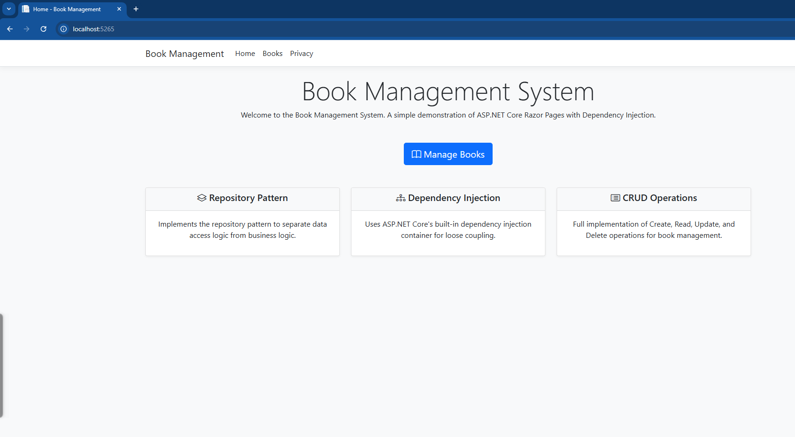
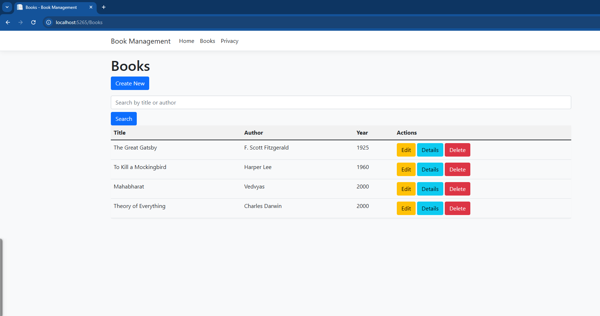
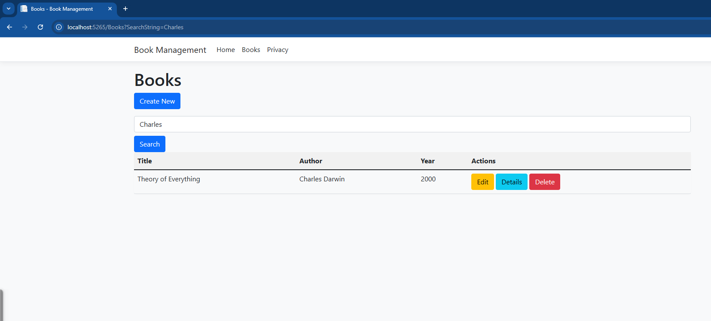
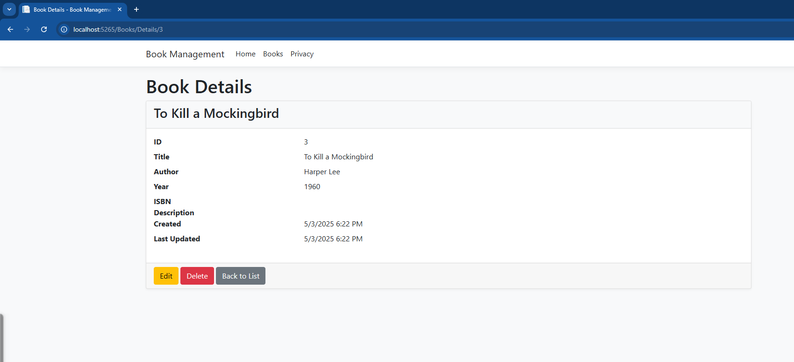

# Book Management Application

## Student Information
- **Name:** Prabesh Aryal
- **Class:** CE1202i
- **University:** Baku Engineering University
- **Program:** Computer Engineering (3rd Year, 6th Semester)
- **Course:** Modern Programming Language - 2
- **Task Type:** Classwork/Class Task

## Project Overview
This is a Book Management application built using ASP.NET Core with Razor Pages, implementing Dependency Injection and the Repository Pattern. The application provides a complete CRUD (Create, Read, Update, Delete) interface for managing books.

## Screenshots

<div style="display: flex; flex-wrap: wrap; gap: 20px; justify-content: center;">
    <div style="flex: 1; min-width: 300px; max-width: 400px;">
        
        <p style="text-align: center; margin-top: 8px;"><strong>Index Page</strong> - Lanidng Page with introduction</p>
    </div>
    <div style="flex: 1; min-width: 300px; max-width: 400px;">
        
        <p style="text-align: center; margin-top: 8px;"><strong>Books List</strong> - Complete list of books</p>
    </div>
    <div style="flex: 1; min-width: 300px; max-width: 400px;">
        
        <p style="text-align: center; margin-top: 8px;"><strong>Search</strong> - Search books by title or author</p>
    </div>
    <div style="flex: 1; min-width: 300px; max-width: 400px;">
        
        <p style="text-align: center; margin-top: 8px;"><strong>Details</strong> - Detailed view of a book</p>
    </div>
</div>

## Features Implemented

### Core Requirements
1. **Book Model**
   - Properties: Id, Title, Author, Year
   - Additional properties: Description, ISBN, CreatedAt, UpdatedAt

2. **Repository Pattern**
   - `IBookRepository` interface with CRUD operations
   - `SingletonBookRepository` implementation with static in-memory storage
   - Initialized with 3 sample books

3. **Dependency Injection**
   - Constructor injection in `BookService`
   - Proper service registration in `Program.cs`
   - Interface-based programming

4. **CRUD Operations**
   - Create: Add new books with validation
   - Read: View all books and individual book details
   - Update: Modify existing book information
   - Delete: Remove books from the collection

5. **Input Validation**
   - Required field validation
   - String length constraints
   - Year range validation
   - ISBN format validation

6. **Exception Handling**
   - KeyNotFoundException handling
   - Null checks
   - Model validation

### Bonus Features
1. **Singleton Pattern**
   - Implemented in `SingletonBookRepository`
   - Ensures single instance of book collection
   - Thread-safe implementation

2. **Search Functionality**
   - Search books by title or author
   - Case-insensitive search
   - Real-time results display

## Technical Implementation
- **Framework:** ASP.NET Core
- **UI:** Razor Pages with Bootstrap
- **Patterns:** Repository Pattern, Singleton Pattern
- **Dependency Injection:** Constructor Injection
- **Validation:** DataAnnotations
- **Storage:** In-memory static collection

## Project Structure
```
WebApplication3/
├── Models/
│   └── Book.cs
├── Interfaces/
│   ├── IBookRepository.cs
│   └── IBookService.cs
├── Services/
│   └── BookService.cs
├── Pages/
│   └── Books/
│       ├── Index.cshtml
│       ├── Create.cshtml
│       ├── Edit.cshtml
│       ├── Details.cshtml
│       ├── Delete.cshtml
│       └── Search.cshtml
└── Program.cs
```

## How to Run
1. Clone the repository
2. Open the solution in Visual Studio
3. Build the solution
4. Run the application
5. Access the web interface at `https://localhost:5001` or `http://localhost:5000`

## Dependencies
- .NET 8.0 or later
- ASP.NET Core
- Bootstrap 5

## Author
- **Name:** Prabesh Aryal
- **GitHub:** [prabeshAryal](https://github.com/prabeshAryal)
- **University:** Baku Engineering University
- **Program:** Computer Engineering (3rd Year, 6th Semester)